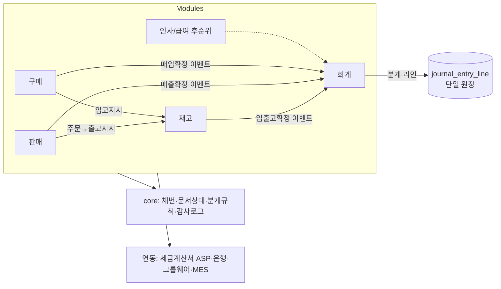

# ERP 설계 계획서 (v1)

> 목적: 상용화 가능한 ERP의 제품 범위·아키텍처·기술 스택·핵심 설계 원칙·개발 로드맵을 확정하기 위한 계획서.
> 근거: [01_ERP_기술조사.md](01_ERP_기술조사.md). 기존 자산은 PFMES(FastAPI+Vue3+Flutter+MSSQL), groupware-v2(NestJS+Next.js+PostgreSQL 모노레포).

---

## 1. 제품 정의 (제안 — 확정 필요)

- **타깃**: 소규모~중소 제조/도소매 기업 (인원 수십~수백 명). PFMES 고객층과 겹침.
- **제품 형태**: 멀티테넌트 SaaS를 기본, 동일 코드로 온프레미스(단일 테넌트) 설치 가능.
- **차별화**: ① 우리 그룹웨어·MES와의 기본 연동(결재·근태·생산실적), ② 한국 세무(세금계산서·부가세) 내장, ③ 설정 기반 커스터마이징으로 도입 기간 단축.
- **범위 밖(MVP)**: 급여/연말정산, 고도화된 원가회계, BI — 로드맵 후순위.

## 2. 기술 스택 (안)

우선순위: **groupware-v2 스택을 재사용**해 두 제품 간 통합(단일 로그인·전자결재·알림)을 쉽게 한다.

| 영역 | 제안 | 근거 |
|---|---|---|
| 언어/빌드 | TypeScript 모노레포 (npm workspaces + turbo) | groupware-v2 동일 구조 재사용 |
| 백엔드 | NestJS 10 + Fastify | 이미 사용 중, 모듈 경계·DI 적합 |
| DB | PostgreSQL (+ RLS로 테넌트 격리) | 멀티테넌트, groupware-v2 동일 |
| ORM/쿼리 | Prisma (계정과목 집계·원장 등 복잡 쿼리는 raw SQL/뷰) | groupware-v2 동일 |
| 프런트엔드 | Next.js 14 + React 18 + TanStack Query | groupware-v2 동일 |
| 데이터 그리드 | AG Grid Community (+ 엔터프라이즈 기능 필요 시 구매 결정) | ERP UX 핵심 |
| 캐시/큐 | Redis + BullMQ | MRP·일괄발행·외부연동 배치 |
| 인증 | Authentik(IdP) SSO + 제품 내 RBAC | 그룹웨어와 통합, groupware-v2 idp 모듈 재사용 |
| 파일/출력 | MinIO(S3 호환) + HTML 템플릿→PDF(Playwright) | 세금계산서·거래명세서 |
| 관측 | OpenTelemetry + Loki/Prometheus 또는 동등 | SaaS 운영 필수 |
| 배포 | Docker + Proxmox VM (자체 인프라) 또는 k8s | 기존 인프라 계획과 일치 |

**대안**: PFMES 스택(FastAPI + Vue3 + MSSQL)으로 가면 MES 코드·데이터 재사용에 유리하지만, 그룹웨어 통합·멀티테넌트·오픈소스 DB 측면에서 상기 스택을 추천. → 결정 필요(§10-1)

## 3. 아키텍처

### 3.1 모듈러 모놀리스

```
erp/
  apps/
    api/            NestJS (REST + Webhook, 내부는 모듈 경계)
    web/            Next.js 관리·업무 화면
  packages/
    core/           공통: 채번, 문서상태, 분개규칙, 통화/날짜, 감사로그
    database/       Prisma 스키마·마이그레이션
    domain-modules/ common(마스터) sales purchasing inventory accounting hr ...
  infra/            docker-compose, IaC
```

- 모듈 간 의존은 `core`가 제공하는 **공개 서비스 인터페이스 + 도메인 이벤트**로만 (모듈 간 내부 테이블 직접 조회 금지).
- 도메인 이벤트는 트랜잭션 아웃박스 테이블 → BullMQ로 전달(예: 출고확정 → 재고 차감 → 매출채권/분개 이벤트).



### 3.2 멀티테넌시

- 모든 업무 테이블에 `tenant_id`, PostgreSQL RLS 정책(`tenant_id = current_setting('app.tenant')`), API 미들웨어에서 설정. 테넌트 간 데이터 조회는 조인 불가.
- 대형 고객/온프레미스는 같은 이미지의 전용 DB — 스키마는 하나만 유지(마이그레이션 일원화).

## 4. 핵심 설계 원칙

### 4.1 회계 (최우선 정확성)
1. **모든 모듈의 거래는 분개 규칙(Posting Rule)을 통해 `journal_entry` + `journal_entry_line` 단일 원장으로** — 모듈별 장부는 뷰/보조장부로 제공.
2. 전표는 Draft → **Posted(불변)**. 정정은 역분개 전표 + 원본 참조. 기간 마감 후 해당 기간 전표 생성·역분개 차단.
3. 차대 합계 일치를 트랜잭션 내 검증 + 주기적 대사 잡(매출채권 잔액 vs 계정 잔액)으로 이중 방어.
4. 금액 `NUMERIC(18,2)`(통화별 소수 자리는 currency 마스터), 통화별 원화환산은 환율 테이블.

### 4.2 문서/업무 공통
1. 모든 업무 문서는 공통 상태머신: `draft → confirmed(→ posted) → cancelled`, 확정 후 수정 불가·정정본 발행.
2. 채번: `{문서유형}-{연도}-{시퀀스}` per 테넌트, 전용 카운터 테이블 행 잠금으로 결번·중복 방지.
3. 마스터(거래처·품목·계정과목)는 버전 없음 대신 **사용중지** + 거래에 스냅샷 필드 저장(예: 거래처명).
4. 감사 로그: 변경 전/후 JSON, actor·시각·IP, 조회 로그는 개인정보 테이블 한정.

### 4.3 재고/생산
1. 재고 수불은 append-only `stock_ledger`(일시·품목·창고·수량·단가·원본문서), 재고 잔량은 `stock_balance` 스냅샷 + 수불부와 대사.
2. 평가: 이동평균 기본, FIFO는 수불부 기반 계산. 역분개 시 재평가 규칙 명시.
3. 출고 동시성: `(item_id, warehouse_id)` 행 잠금으로 음수재고 방지(옵션: 테넌트별 음수재고 허용 플래그).
4. BOM/MRP: 제조 모듈은 Phase 2. MES(PFMES)가 있다면 작업지시·실적은 MES 소유, ERP는 수불·원가만 연동 — **경계 명확화**.

### 4.4 커스터마이징(상용화의 생명줄)
1. 고객 코드는 **절대 별도 브랜치/포크로 관리하지 않는다**.
2. 제공 수단: ① 커스텀 필드(JSONB `custom_fields` + 폼 메타데이터), ② 인쇄 양식 템플릿(고객별), ③ 승인 규칙·채번 규칙 설정, ④ 웹훅/API.
3. 그래도 부족하면 `custom/` 디렉터리의 테넌트 플러그인(코어와 계약 인터페이스만) — 기술조사 §2.1 Clean Core.

### 4.5 보안·규제
1. 고유식별정보(주민번호·계좌) 컬럼 암호화(AES-256-GCM, 키는 KMS/별도 볼트), 조회 감사로그.
2. 비밀번호는 IdP 위임, 제품 내 세션은 OIDC. 서비스 간 통신은 서명된 토큰.
3. 백업: PITR 가능한 PostgreSQL 백업 + 일별 스냅샷, RPO/RTO 목표 정의(제안: RPO 15분, RTO 4시간).

## 5. 모듈 범위

| 모듈 | 주요 화면/기능 | 우선순위 |
|---|---|---|
| 공통 기준정보 | 회사/사업장/부서/사원, 거래처(여신한도), 품목/BOM, 창고, 계정과목, 은행계좌, 환율, 코드 관리 | P0 |
| 영업/판매 | 견적 → 수주 → 출고지시 → 출고 → 매출(세금계산서) → 수금, 거래명세서 | P0 |
| 구매 | 구매요청 → 발주 → 입고 → 매입 → 지급 | P0 |
| 재고 | 입출고, 창고이동, 재고조정, 실사, 수불부/재고현황, 안전재고 | P0 |
| 회계 | 자동분개, 전표입력, 총계정원장/계정별원장/보조부, 시산표, 재무제표(재무상태표·손익계산서), 부가세 신고 자료, 기간마감 | P0 |
| 전자세금계산서 | 발행(정/수정), 국세청 전송(연계 사업자), 매입 수집, 발행 이력 | P0 |
| 채권/채무·자금 | 미수/미지급 관리, 수금·지급, 통장 입출내역 연동, 자금일보/자금계획 | P1 |
| 생산관리 | 작업지시, 소요량(MRP), 입출고 연동, 공정 실적(MES 연동) | P1 |
| 원가 | 실적 원가 집계, 품목별 원가 | P2 |
| 인사/급여 | 근태(그룹웨어 연동), 급여계산, 원천세, 연말정산, 4대보험 | P2 (요율 연도별 데이터화) |
| 고정자산 | 취득/감가상각/처분, 감가상각 자동분개 | P2 |
| 대시보드/리포트 | 경영 지표, 커스텀 리포트 | P2 |
| 확장 | 커스텀 필드, 인쇄양식, 승인규칙, 웹훅, Open API | P1부터 점진 |

## 6. 주요 데이터 모델 (스케치)

```
tenant ── company ── business_site ── department ── employee
customer(vendor 겸용), item, bom, warehouse
sales_order + sales_order_line ── shipment ── sales_invoice(세금계산서) ── receipt
purchase_order + line ── goods_receipt ── purchase_invoice ── payment
stock_ledger(append-only), stock_balance
account(계정과목) ── journal_entry + journal_entry_line (차/대: account, partner, cost_center, memo, amount, currency, exchange_rate)
posting_rule(이벤트유형 → 차/대 계정 매핑, 테넌트별 설정)
doc_sequence, audit_log, custom_field_def, print_template
```

- `journal_entry`는 `source_type`/`source_id`(예: `sales_invoice:123`)로 원본 문서 역추적 — 원장에서 업무 화면으로 드릴다운.

## 7. 한국 연동 설계

| 기능 | 방식 |
|---|---|
| 전자세금계산서 발행/전송 | 연계 사업자(Popbill·Barobill·SmartBill 중 1사 택일, 어댑터 패턴으로 교체 가능) — 인증서는 사업자가 보관 |
| 매입 수집·카드·현금영수증 | 연계 사업자 또는 데이터 수집 API — 스케줄 수집 → 매입 전표 초안 |
| 사업자 상태조회 | 공공데이터포털 국세청 API (거래처 등록·발행 전 검증) |
| 은행 입출내역 | 오픈뱅킹 or 수집 API (P1) |
| 급여 기준 | 요율표·간이세액표를 `annual_policy` 테이블로 관리(연도·항목별 JSON), 매년 마스터 데이터 갱신 |

## 8. 개발 로드맵 (안)

| 단계 | 내용 | 산출물 |
|---|---|---|
| M0 | 이 계획서 확정(§10 결정), DB ERD, 화면 목업(그리드 UX), 코어 스캐폴드 | 상세 설계서, ERD, 목업 |
| M1 | 공통 기준정보 + 문서 프레임워크(상태·채번·감사로그·권한) | 기준정보 CRUD, 문서 프레임워크 |
| M2 | 판매·구매·재고 사이클 + 재고 수불부 | 주문~입출고 e2e |
| M3 | 회계 엔진(분개규칙·원장·결산) + 전자세금계산서 연동 | 재무제표, 부가세 자료 |
| M4 | 채권/채무·자금, 이관 도구(엑셀/더존 export), 온보딩 | 파일럿 도입 가능 상태 |
| M5 | 생산관리·MRP, 확장 기능(커스텀필드·인쇄양식), 멀티테넌트 SaaS 운영 | 상용 출시 |
| M6+ | 급여, 원가, 고정자산, BI | 버전 업 |

- 파일럿 전략: 지인 업체 1~2개사 또는 자사 업무로 실사용 검증 후 판매.
- 이관: 더존/이카운트의 엑셀보내기 포맷을 그대로 받는 임포트 마법사(기초잔액 + 거래처/품목/계정과목).

## 9. 품질·운영 요구사항

- 테스트: 회계 불변식(차대 일치·마감후 차단·재고 음수 방지) 자동 테스트를 회귀 스위트로; 분개 규칙은 골든 데이터셋 테스트.
- 성능 목표(제안): 월 수십만 건 전표 기준 원장 조회 p95 < 1s — 분개 라인에 테넌트+기간 복합 인덱스, 집계 뷰.
- 관측: API·배치 메트릭, 슬로우 쿼리, 연동 실패 알림.
- 업그레이드: 스키마 마이그레이션 자동화, 테넌트별 롤링, DB 하위호환 유지(무중단 배포).
- 개인정보: 주민번호 등 암호화, 접근기록 3년 보관 검토, 탈퇴·폐업 고객 데이터 파기 정책.

## 10. 결정 필요 사항

1. **기술 스택 확정**: NestJS/Next.js/PostgreSQL(groupware-v2 재사용, 추천) vs FastAPI/Vue3/MSSQL(PFMES 계열). MES와의 DB 직접 통합이 필요하면 후자도 검토.
2. **제품 형태**: SaaS 우선 vs 온프레미스 납품 우선(인증서·세금계산서 방식과 배포가 달라짐).
3. **타깃 업종**: 제조(BOM/MRP 조기 포함) vs 도소매(더 단순) — 첫 파일럿 고객 기준으로 결정.
4. **급여 시점**: 한국 ERP 경쟁력상 필수지만 요율·규정 부담이 큼. P2로 미루되 회계 자동분개 인터페이스는 미리 확보.
5. **전자세금계산서 연계 사업자**: 팝빌/바로빌/스마트빌 과금·기능 비교 후 확정.
6. **MES 경계**: PFMES와 이 ERP의 역할 분담(ERP는 수불·원가·판매, MES는 작업지시·실적 수집) — 통합 제품으로 갈지 별도 제품 연동으로 갈지.
7. **오픈소스 활용 범위**: 자체 개발 기본. ERPNext/Odoo 포크는 GPL 라이선스 리스크로 비추천.
