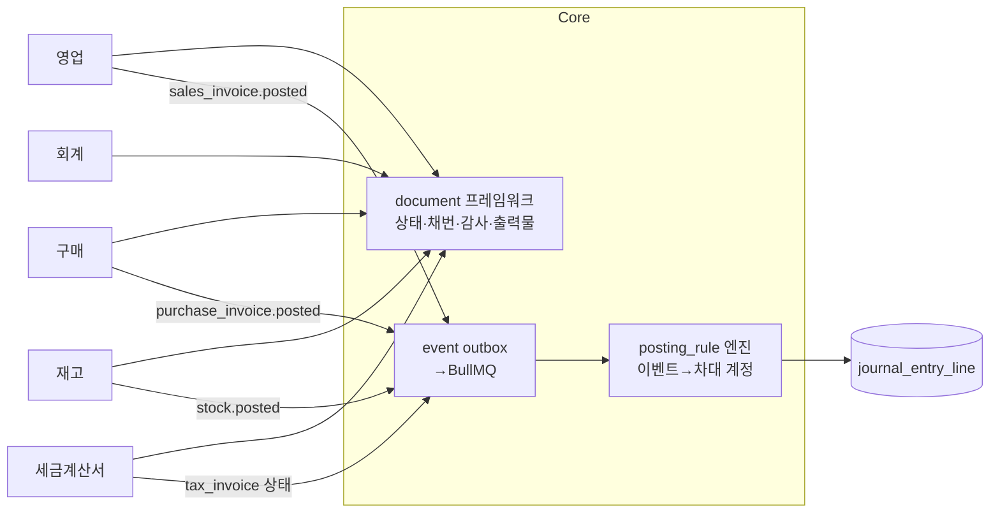

# ERP 모듈별 설계 계획서

> 목적: [03_ERP_필요기능_설계계획서.md](03_ERP_필요기능_설계계획서.md)에서 확정한 기능 범위를 모듈 단위 설계로 내린다 — 각 모듈의 화면 목록, 데이터 모델, 문서 상태, 분개 규칙, API, 검증 규칙을 정의한다.
> 근거: [02_ERP_설계계획서.md](02_ERP_설계계획서.md)(아키텍처·원칙), [03](03_ERP_필요기능_설계계획서.md)(기능 범위). 본 문서는 상세 설계서 입력물.
> 범위: P0 모듈 상세(기준정보·영업·구매·재고·회계·세금계산서) + P1 이후 개요.
> 표기: 우선순위는 03 문서 기준. 테이블/필드명은 구현 시 확정될 논리명 — 스택 미결(NestJS+PostgreSQL 추천)과 무관하게 적용 가능.

---

## 0. 공통 설계 기반 (전 모듈 공유)

모든 업무 문서는 `core`의 문서 프레임워크를 따른다. 모듈 설계에서는 이것을 반복 기술하지 않는다.

- **문서 상태**: `draft → confirmed → posted → cancelled`. `posted` 후 수정 불가, 정정은 취소+정정본(Amend) 또는 역분개.
- **채번**: `{모듈코드}-{유형}-{YYYY}-{seq}` per 테넌트 — `doc_sequence` 행 잠금.
- **헤더+라인**: 거래 문서는 `*_header` + `*_line` 2단 구조, 라인이 수량·단가·계정 등 상세를 가짐.
- **이벤트**: `posted` 시 도메인 이벤트를 아웃박스에 기록 → 비동기로 재고/채권/분개 갱신 (02 §3.1).
- **화면 패턴**: 조회 = 필터바+그리드 / 입력 = 헤더폼+라인그리드(엑셀식) / 공통 액션: 확정·취소·출력·엑셀업로드.
- **API 규약**: REST `/{module}/{doc}` — 목록 `GET`, 단건 `GET /{id}`, 생성 `POST`, 수정 `PATCH /{id}`(draft만), 상태전이 `POST /{id}:confirm|:post|:cancel`, 출력 `GET /{id}/print?form=`. 응답은 RFC9457 problem+json 오류.
- **권한**: 메뉴 권한(읽기/쓰기/확정) + 데이터 범위(회사·사업장·부서). 모든 행에 `tenant_id` + RLS.

---

## 1. 기준정보 모듈 (P0)

### 개요
전 모듈이 참조하는 마스터 데이터. 변경 이력과 사용중지 관리가 핵심 — 거래 문서는 마스터 값을 스냅샷으로 저장한다.

### 화면/메뉴

| 메뉴 | 내용 |
|---|---|
| 회사·사업장 | 회사, 사업장(사업자등록번호, 부가세 신고 단위) |
| 부서·사원 | 조직도, 사원(계정 연결, 담당자 지정용) |
| 거래처 | 고객/공급처 겸용 구분, 여신한도, 사업자 상태조회 버튼, 사용중지 |
| 품목 | 분류(그룹 트리), 단위, 과세/면세, 세트품목, 바코드(P1), 사용중지 |
| BOM | 품목별 구성품목 정/역전개 (P1, 재고·생산 참조) |
| 창고 | 창고·보관장소 트리 |
| 계정과목 | 계정 트리, 보조부 설정(거래처/부서/프로젝트), 사용중지, 기준 템플릿 임포트 |
| 은행계좌·카드·어음 | 자금 마스터 (P1에서 활성) |
| 코드 관리 | 공통코드(그룹/코드/정렬/사용여부) |
| 환율·통화 | P1 |

### 데이터 모델

| 테이블 | 주요 컬럼 |
|---|---|
| `company` / `business_site` | id, name, biz_no, 대표자, 업태/종목, 주소, 세무서 |
| `department` / `employee` | id, parent_id, name / emp_no, name, dept_id, user_id |
| `partner` | id, type(customer/vendor/both), biz_no, name, 담당자, credit_limit, vat_id, addr, is_active |
| `item` | id, code, name, spec, unit, item_group_id, tax_type(과세/면세/영세), sale_price, is_active |
| `bom` / `bom_line` | item_id, ver, is_active / child_item_id, qty, loss_rate |
| `warehouse` | id, site_id, code, name, parent_id |
| `account` | id, code, name, parent_id, acct_type, aux_partner/dept/project 플래그, is_active |
| `bank_account`, `credit_card`, `bill` | 자금 마스터 |
| `code_group` / `code` | 공통코드 |

- 품목·거래처·계정과목은 **사용중지**만(삭제 없음), 문서에 `partner_name`, `item_name` 스냅샷 컬럼.

### 불변식·검증
- `biz_no` 중복 차단(테넌트 내 유일), 사업자 상태조회로 등록 시 휴·폐업 경고.
- 계정과목: 하위 계정 있는 계정은 전표 사용 불가(말단 계정만), 사용중지 계정 신규 전표 차단.

### API 스케치
`GET/POST /mdm/partners`, `PATCH /mdm/partners/{id}`, `POST /mdm/partners/{id}:biz-check`, `/mdm/items`, `/mdm/accounts`, `/mdm/warehouses`, `/mdm/codes` — 표준 CRUD + `:activate|:deactivate`.

### 수용 기준
- 마스터 CRUD + 엑셀 일괄등록, 사용중지 마스터가 신규 문서 라인에서 선택 불가.

---

## 2. 영업 모듈 (P0)

### 개요
견적→수주→출고→매출→세금계산서→수금의 판매 파이프라인. 매출 확정이 재고 차감·자동분개·세금계산서 발행을 유발하는 트리거 모듈.

### 화면/메뉴

| 메뉴 | 내용 |
|---|---|
| 견적 관리 | 견적서 입력/출력, 수주 전환, 버전 |
| 수주 관리 | 수주서, 납기·잔량·마감, 부분출고 허용 |
| 출고 지시/확정 | 수주→출고지시→출고확정(재고 차감) |
| 매출 관리 | 매출 확정 = 세금계산서 대상 생성 + 자동분개 |
| 반품 | 매출 참조 반품(입고 복귀 + 수정계산서) |
| 수금 | 수금 등록·미수 상계 (P1) |
| 조회 | 수주잔량, 거래처별/품목별 매출, 여신현황, 채권연령(P1) |

### 데이터 모델

| 테이블 | 주요 컬럼 |
|---|---|
| `sales_quote`(+line) | 견적 — doc_no, partner, valid_until, status / item, qty, price, vat_rate |
| `sales_order`(+line) | 수주 — doc_no, partner, site, due_date, status / item, qty, price, shipped_qty |
| `shipment`(+line) | 출고 — order 참조, warehouse, ship_date, status / item, qty |
| `sales_invoice`(+line) | 매출 — doc_no, partner, site, supply_date, supply_amt, vat_amt, status, tax_invoice_id |
| `sales_return`(+line) | 반품 — 원 매출/출고 참조 |
| `receipt` | 수금 — partner, amount, settle_method, invoice 링크 (P1) |

- 라인: `item_id`, 스냅샷(name/spec/unit), qty, unit_price, supply_amt=qty×price, vat_amt, account(매출계정), warehouse.

### 상태·흐름
- quote: `draft→sent→ordered|expired`
- order: `draft→confirmed→(부분출고 반복)→closed|cancelled`
- shipment: `draft→confirmed` → 재고 이벤트(`stock.out`)
- invoice: `draft→posted` → 분개 + `tax_invoice` 생성 / 정정은 반품 또는 수정계산서

### 분개 규칙 (posting_rule 예시)
| 이벤트 | 차변 | 대변 |
|---|---|---|
| sales_invoice.posted | 외상매출금 (또는 보통예금) | 제품매출 + 부가세예수금 |
| receipt.posted | 보통예금 | 외상매출금 |
| sales_return.posted | 제품매출(마이너스)·부가세예수금(마이너스) | 외상매출금 |

### 검증
- 출고가능수량 = 수주잔량·재고가용량 — 초과 출고 차단(음수재고 정책은 테넌트 설정).
- 여신한도 초과 시 경고(기본)/차단(설정).
- 공급가액×세율 반올림 규칙 = 라인별 반올림 후 합계 (세금계산서와 동일 규칙 필수).

### API 스케치
`/sales/quotes`, `/sales/orders`, `/sales/shipments`, `/sales/invoices`, `/sales/returns`, `/sales/receipts` + `POST /sales/invoices/{id}:issue-tax`(세금계산서 발행), `GET /sales/orders/{id}/progress`.

### 수용 기준
- 수주→출고→매출→수정계산서까지 종단 흐름, 출고 시 재고 차감·매출 시 분개·세금계산서 초안이 이벤트로 연결.

---

## 3. 구매 모듈 (P0)

### 개요
영업의 대칭 — 구매요청→발주→입고→매입→지급. 동일 문서 프레임워크·분개 엔진 공유.

### 화면/메뉴
구매요청 / 발주 관리 / 입고(검수) / 매입 관리 / 매입반품 / 지급(P1) / 조회(발주잔량·매입처별 매입·미지급).

### 데이터 모델

| 테이블 | 주요 컬럼 |
|---|---|
| `purchase_request`(+line) | 부서 요청 — 필요일, status (P1, P0은 발주 직접 생성 허용) |
| `purchase_order`(+line) | 발주 — vendor, due_date / item, qty, price |
| `goods_receipt`(+line) | 입고 — order 참조, warehouse, 검수수량·불량수량, status |
| `purchase_invoice`(+line) | 매입 — supply_date, supply_amt, vat_amt, status, 수집원(tax_api/manual) |
| `purchase_return`(+line) | 매입 반품 |
| `payment` | 지급 — partner, amount, settle_method (P1) |

### 상태·흐름·분개
- receipt.confirmed → `stock.in` 이벤트 + 검수 대기 수량 처리
- invoice.posted → 분개: 차=재고자산·부가세대급금 / 대=외상매입금
- payment.posted → 차=외상매입금 / 대=보통예금

### 수용 기준
- 발주→입고(검수)→매입→매입계산서 수집 매칭까지 종단 흐름, 입고 불량은 재고 미반영.

---

## 4. 재고 모듈 (P0)

### 개요
모든 입출고의 기록지. 원장은 append-only `stock_ledger`, 조회는 `stock_balance` 스냅샷 — 판매·구매·생산의 수량 원천.

### 화면/메뉴
입출고 등록 / 창고이동 / 재고조정 / 재고실사 / 수불부·품목별 현재고·창고별 현재고·기간별 수불 / 안전재고 설정(P1).

### 데이터 모델

| 테이블 | 주요 컬럼 |
|---|---|
| `stock_ledger` | id, occurred_at, item_id, warehouse_id, io_type(in/out), reason(유형 코드), qty, unit_cost, balance_after?, source_type/id, posted_by — **append-only, UPDATE/DELETE 금지** |
| `stock_balance` | (item_id, warehouse_id) PK, qty, avg_cost, updated_at |
| `stock_count`(+line) | 실사 — 기준일, book_qty, actual_qty, diff → 조정 전표 생성 |
| `stock_adjust`(+line) | 조정 — 사유, qty, cost |

### 처리 규칙
- 입고/출고 확정 시 `stock_ledger` insert + `stock_balance` 갱신을 **한 트랜잭션**으로. 출고는 `(item,warehouse)` 행 잠금으로 음수 방지.
- 단가: 입고는 문서 단가, 출고·이동평균 재계산은 `avg_cost = (기존금액+입고금액)/(기존수량+입고수량)`.
- 취소/역처리는 반대 방향 ledger 행 추가(삭제 금지), 재평가 규칙은 02 §4.3.
- 원가 변경(조정)은 `reason=cost_adj` 행으로.

### 이벤트 연동
- `stock.in/out.posted` → 회계로 자동분개(재고자산 차대) — 분개 대상 유형은 설정(전부 또는 조정·실사만).

### 수용 기준
- 동시 출고 경쟁에서 음수재고 미발생(동시성 테스트), 수불부 합계와 balance 일치 대사 잡 통과.

---

## 5. 회계 모듈 (P0 — 정확성 최우선)

### 개요
모든 거래가 모이는 단일 원장. 자동분개(posting_rule) + 수기 전표, 장부·재무제표·부가세 자료·기간마감.

### 화면/메뉴
전표 입력 / 전표 조회·승인 / 총계정원장 / 계정별원장 / 보조부(거래처·부서·프로젝트) / 일·월계표 / 시산표 / 재무상태표·손익계산서 / 부가세 신고자료 / 기간마감 / 분개규칙 설정 / 환율(P1).

### 데이터 모델

| 테이블 | 주요 컬럼 |
|---|---|
| `journal_entry` | id, doc_no, entry_date, site_id, status, source_type/id, memo, posted_at |
| `journal_entry_line` | entry_id, seq, dc(d/c), account_id, partner_id?, dept_id?, project_id?, memo, amount, currency, fx_rate |
| `posting_rule` | event_type, 조건(품목유형·거래처유형 등), dc, account_id, amount_expr — 테넌트 설정 |
| `fiscal_period` | site_id, year, period, closed_at — 마감 테이블 |
| `account_template` | 기준별 계정 템플릿 |

### 불변식 (회귀 테스트 대상)
- posted 전표는 `Σ차 = Σ대` — 트랜잭션 내 검증.
- `journal_entry`/`line`은 `posted` 후 UPDATE 금지, 정정은 `reversal_of` 참조 역분개.
- 마감 기간의 전표 생성·역분개 차단.
- 말단 계정만 사용, 보조부 필수 계정은 대상 누락 차단.
- 금액 `NUMERIC(18,2)`, 통화별 소수자리·반올림 규칙 통일.

### 처리 흐름
- 아웃박스 이벤트 → posting_rule 조회 → `journal_entry`+lines 생성 → `posted`. 수기 전표는 UI 입력 → confirm → post.
- 원장 조회: `journal_entry_line` 기준 + 계정/기간 인덱스, 시산표·재무제표는 집계 뷰 + 캐시.
- 부가세 자료: 매출·매입 전표를 사업장·과세유형별 합계 → 신고서식 매핑(파일 또는 화면).

### 수용 기준
- 판매·구매·재고 이벤트가 규칙대로 전표 생성, 역분개 정정, 마감 차단, 시산표 차대 일치, 재무제표 합계 = 원장 합계.

---

## 6. 전자세금계산서 모듈 (P0 — 국내 필수)

### 개요
매출·매입의 세무 확정 계층. 연계 사업자 API 뒤에 어댑터를 두어 사업자 교체 가능 구조.

### 화면/메뉴
발행 대기(매출 확정분) / 발행 진행단계(전송 상태) / 수정 발행 / 매입 수집(수집→매칭→매입전표 초안) / 발행 이력·상태 / 홈택스 자료 비교 / 증빙 수집(카드·현금영수증, P1) / 연계 사업자 설정.

### 데이터 모델

| 테이블 | 주요 컬럼 |
|---|---|
| `tax_invoice` | id, nts_confirm_no(승인번호), type(정/수정), issue_type(정발행/역발행/위수탁), supplier(공급자 site)·recipient(공급받는자 partner) 스냅샷, supply_amt, tax_amt, item_desc, status(draft→issued→sent→confirmed/cancelled), mgt_key, modify_reason, original_id, api_provider, api_tx_id |
| `tax_invoice_line` | 일자, 품목, 규격, 수량, 단가, 공급가액, 세액, 비고 |
| `tax_invoice_purchase` | 매입 수집분 — 원천데이터 + 매칭된 purchase_invoice, 상태(수집→매칭→확정) |
| `tax_api_log` | 사업자 호출·응답·재시도 |

### 처리 흐름
- `sales_invoice.posted` → `tax_invoice` 초안(또는 즉시 발행 설정) → 사업자 API `RegistIssue` → 상태는 비동기 폴링/콜백으로 갱신.
- 수정: 사유 코드 + 원본 참조 수정계산서 발행(음수 또는 정 수정 규칙 준수).
- 매입: 스케줄 수집 → 판매자 사업자번호·일자·금액으로 `purchase_invoice`와 매칭 → 불일치 건 수기 매칭.
- 발행 기한: 발급일 다음날 전송 의무 — 지연 경고 배지.

### 어댑터 인터페이스 (사업자 교체)
`ITaxBillProvider`: `issue`, `cancel`, `modify`, `getStatus`, `collectPurchases`, `charge` — 구현: Popbill / Barobill / SmartBill 중 선정 후 1사부터 (02 §10-5).

### 수용 기준
- 발행→전송→상태 추적→수정→매입 수집·매칭 흐름, 사업자 어댑터가 계약 뒤에 숨어 다른 사업자로 교체 가능(모의 어댑터 테스트).

---

## 7. P1+ 모듈 개요 (상세는 다음 단계)

| 모듈 | 범위 요약 | 비고 |
|---|---|---|
| 채권/채무·자금 | 미수·미지급 잔액, 수금·지급, 자금일보·자금계획, 통장 거래내역 연동, 어음 | 영업·구매와 같은 문서 프레임워크 |
| 생산 | BOM(기준정보에 이미 배치), 작업지시, 소요량→발주제안(MRP), 자재불출·제품입고 | 작업지시·실적은 MES 경계 (03 §6-6) |
| 확장 플랫폼 | 커스텀필드(JSONB+폼메타), 인쇄양식 템플릿, 승인규칙·채번규칙, OpenAPI·웹훅 | 02 §4.4 Clean Core |
| 인사/급여 | 인사카드·근태 연동·급여계산·원천세·4대보험·연말정산 — `annual_policy` 데이터 | P2 |
| 고정자산 | 취득·감가상각(정액/정률)·처분·자동분개 | P2 |
| 대시보드/리포트 | KPI 카드·분석 리포트(매출·손익·채권·재고) | P1 기본 대시보드부터 |

---

## 8. 모듈 의존·이벤트 맵

| 이벤트 | 발행 → 구독 | 결과 |
|---|---|---|
| shipment.confirmed | 영업 → 재고 | stock_ledger(out) + balance 차감 |
| goods_receipt.confirmed | 구매 → 재고 | stock_ledger(in) + balance 증가 |
| sales_invoice.posted | 영업 → 회계·세금계산서 | 분개 + tax_invoice 초안 |
| purchase_invoice.posted | 구매 → 회계 | 분개 |
| tax_invoice.state_changed | 세금계산서 → 영업 | 매출 화면에 발행 상태 |
| receipt/payment.posted | 자금 → 회계·영업·구매 | 분개 + 채권·채무 상계 |
| stock.adjust/count.posted | 재고 → 회계 | 평가·조정 분개 |

- 모듈 간 호출은 공개 서비스 인터페이스·이벤트만 — 내부 테이블 직접 조인 금지 (02 §3.1).

---

## 9. 신규 결정 필요 사항

1. **문서 상태 세분화**: 출고지시(approve 단계)를 별도 문서로 둘지, 수주의 상태로 둘지 — 기본은 별도 `shipment` 문서.
2. **자동분개 대상 범위**: 재고 수불의 모든 유형을 분개할지(정확) vs 조정·실사만(단순) — 테넌트 설정으로 기본값 정하기.
3. **세금계산서 발행 시점**: 매출 확정 시 즉시 vs 발행 대기 목록에서 사용자 승인 후 — 기본은 대기 목록(실무상 금액 확인 후 발행이 일반적).
4. **수금/지급 상계 규칙**: invoice 단위 상계 vs 거래처 잔액 상계 — 기본 invoice 단위 + 잔액 조정.
5. **라인별 창고**: 출고·입고 라인마다 창고 지정 허용 여부 — 허용(헤더 창고는 기본값으로).
