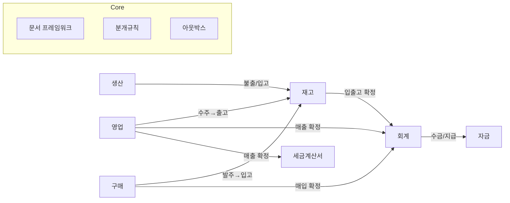

# 00. 공통 설계 기반

> 목적: 모든 업무 모듈이 공유하는 문서 프레임워크·화면/API 패턴·권한·이벤트 규약을 한 곳에 고정한다. 각 모듈 문서는 여기 정의한 것을 반복 기술하지 않는다.
> 근거: [02_ERP_설계계획서.md](../02_ERP_설계계획서.md) §3~§4.

---

## 1. 문서 프레임워크

### 1.1 상태머신 (전 거래 문서 공통)

```
draft ──confirm──▶ confirmed ──post──▶ posted
  │                  │                    │
  └────cancel────────┴────────▶ cancelled │
                                         ▼
                              정정: 역분개/정정본(Amend) — posted 수정 불가
```

| 상태 | 의미 | 수정 | 부수 효과 |
|---|---|---|---|
| draft | 작성 중 | 가능 | 없음 |
| confirmed | 내용 확정(업무 승인) | 불가 | 일부 모듈은 여기서 재고 이벤트 |
| posted | 회계·세무 확정 | 불가 | 분개·세금계산서·채권 생성 |
| cancelled | 취소 | 불가 | 원본 참조 보존 |

- 모듈별로 `sent`, `closed`, `ordered` 같은 중간 상태를 추가할 수 있으나 `draft/confirmed/posted/cancelled` 어휘는 유지.
- `posted` 이후 변경은 오직 취소+정정본 발행(Amend) 또는 역분개 — 감사 추적 필수.

### 1.2 헤더+라인 구조

- 거래 문서는 `*_header`(문서번호·거래처·일자·상태) + `*_line`(품목·수량·단가·계정 등) 2단.
- 라인에 스냅샷 컬럼(`item_name`, `partner_name` 등) — 마스터 변경이 과거 문서를 오염시키지 않게.
- 금액 계산: `supply_amt = qty × unit_price`, `vat_amt`는 **라인별 반올림 후 합계**(세금계산서 규칙과 일치해야 함).

### 1.3 채번

- 형식: `{모듈}-{유형}-{YYYY}-{seq:06d}` per `tenant_id`(+선택 `site_id`).
- `doc_sequence(tenant_id, doc_type, year, last_no)` 행을 `SELECT ... FOR UPDATE`로 잠가 중복·결번 방지.
- 결번 발생 시(트랜잭션 롤백)는 기록만 남기고 재사용 금지 — 세무 문서 연번 누락 방지 원칙.

### 1.4 인프라·공용 테이블 (공통 프레임워크 소유)

| 테이블 | 용도 |
|---|---|
| `doc_sequence` | 채번 시퀀스 행 (tenant_id, doc_type, year, last_no) — 09의 `sequence_rule`은 패턴 설정, 본 테이블은 런타임 카운터 |
| `outbox_event` | 트랜잭션 아웃박스 — 도메인 이벤트 기록, BullMQ 워커가 소비 |
| `audit_log` | 변경 전/후 JSON + actor·시각·IP (§5) |

### 1.5 테이블명 딕셔너리 (모듈 간 공유 테이블)

| 테이블 | 소유 모듈 | 참조 모듈 |
|---|---|---|
| `partner`, `item`, `bom`/`bom_line`, `warehouse`, `account`, `bank_account` | 01 기준정보 | 전 모듈 (마스터) |
| `partner_price` | 02 영업 | 01, 03 — 거래처×품목 단가. **구매는 `vendor_price` 사용(동일 개념, 명칭 구분 유지)** |
| `vendor_price` | 03 구매 | — |
| `stock_ledger`, `stock_balance` | 04 재고 | 00, 08, 13 (공개 서비스 경유) |
| `journal_entry` + `_line`, `posting_rule` | 05 회계 | 전 모듈 (이벤트 경유) |
| `tax_invoice`, `tax_invoice_purchase` | 06 세금계산서 | 02, 03 (id 참조) |
| `receipt`/`receipt_allocation`, `payment`/`payment_allocation` | 07 자금 | 02, 03 (조회·링크만) |
| `material_issue`, `production_receipt` | 08 생산 | 13 (구독) |

- 규칙: 동일 개념이 모듈별로 다른 명칭을 쓰는 경우 여기에 매핑을 등록한다. 신규 테이블 추가 시 소유 모듈을 반드시 표기한다.

## 2. 이벤트/연동 규약

- `posted`/`confirmed` 전이 시 도메인 이벤트를 **트랜잭션 아웃박스 테이블**에 기록 → BullMQ 워커가 구독자에게 전달.
- 이벤트명: `{aggregate}.{action}` — 예: `sales_invoice.posted`, `shipment.confirmed`.
- 비동기 구독자: 회계(분개), 세금계산서(발행 초안), 채권채무(상계), 알림, 웹훅.
- **재고 수불은 동기 예외**: `stock_ledger`/`stock_balance` 반영은 문서 확정 트랜잭션 안에서 재고 모듈의 공개 서비스(`stock.apply(source_type, source_id, lines[])`)를 **동기 호출**한다. 수불을 비동기로 두면 "문서 확정 ↔ 재고 반영"의 원자성이 깨지기 때문. 멱등키는 `source_type + source_id`. 재고 반영 실패 시 문서 확정 전체가 롤백된다.
- 모듈 간 호출은 공개 서비스 인터페이스 또는 이벤트만 — **다른 모듈 테이블 직접 조인 금지**.

## 3. API 규약

| 패턴 | 엔드포인트 |
|---|---|
| 목록 | `GET /v1/{module}/{resource}?filters&cursor` — 커서 페이지네이션 |
| 단건 | `GET /v1/{module}/{resource}/{id}` |
| 생성 | `POST /v1/{module}/{resource}` (멱등키 `Idempotency-Key` 허용) |
| 수정 | `PATCH /v1/{module}/{resource}/{id}` — draft만 |
| 상태 전이 | `POST /v1/{module}/{resource}/{id}:confirm` `:post` `:cancel` |
| 출력 | `GET /v1/{module}/{resource}/{id}/print?form={template}` |
| 엑셀 | `POST /v1/{module}/{resource}:import` / `GET ...:export` |

- API 버저닝: 모든 엔드포인트는 `/v1` prefix. 하위호환이 깨지는 변경은 `/v2`로, 구버전은 6개월 유지 후 폐기. (모듈 문서의 API 스케치에서는 prefix를 생략하고 표기한다.)

- 오류: RFC9457 problem+json, `code`는 도메인 코드(예: `STOCK_INSUFFICIENT`, `PERIOD_CLOSED`).
- 인증: OIDC(IdP). API 토큰은 테넌트별 발급, 스코프 제한.

## 4. 화면 패턴

| 패턴 | 구성 |
|---|---|
| 조회 목록 | 필터바(기간·거래처·상태) + AG Grid + 액션바(신규·엑셀·출력) |
| 문서 입력 | 헤더 폼 + 라인 그리드(엑셀식 편집, 합계 자동) + 첨부 |
| 문서 상세 | 상태 배지 + 액션(확정·취소·출력·복사·엑셀) + 연결 문서 링크(원본→후속) |
| 조회성 | 조건 입력 + 그리드 + 인쇄·엑셀 (요약/연령/현황) |

## 5. 권한·감사

- 메뉴 권한: `read`/`write`/`confirm`(확정 권한 분리 — 입력자와 승인자 분리 운영 가능).
- 데이터 범위: 회사→사업장→부서 축으로 필터. 기본 본인 소속 범위.
- 감사 로그: 변경 전/후 JSON + actor·시각·IP. 개인정보(주민번호·계좌) 조회 로그 별도.
- 모든 테이블 `tenant_id` + PostgreSQL RLS — API 미들웨어가 `app.tenant` 설정.

## 6. 모듈 의존·이벤트 맵

| 이벤트 | 발행 → 구독 | 결과 |
|---|---|---|
| `shipment.confirmed` | 영업 → 재고 (동기, 확정 트랜잭션 내) | `stock_ledger(out)` + balance 차감 |
| `goods_receipt.confirmed` | 구매 → 재고 (동기) | `stock_ledger(in)` + balance 증가 |
| `shipment.confirmed` | 영업 → 회계 (비동기, 테넌트 설정 시) | 매출원가 분개 (02 §5 선택 규칙) |
| `goods_receipt.confirmed` | 구매 → 회계 (비동기, 테넌트 설정 시) | 미착상품 분개 (03 §5 입고 시점 분개 ON 시) |
| `sales_return.posted` | 영업 → 재고(동기)·회계·세금계산서(비동기) | 반품 입고 + 역분개 + 수정계산서 연결 |
| `purchase_return.posted` | 구매 → 재고(동기)·회계(비동기) | 반품 출고 + 역분개 |
| `sales_invoice.posted` | 영업 → 회계·세금계산서 (비동기) | 분개 + `tax_invoice` 초안 |
| `purchase_invoice.posted` | 구매 → 회계 (비동기) | 분개 |
| `tax_invoice.state_changed` | 세금계산서 → 영업 (비동기) | 매출 화면에 발행 상태 |
| `receipt.posted`/`payment.posted` | 자금 → 회계·영업·구매 (비동기) | 분개 + 채권/채무 상계 |
| `stock_adjust.posted`, `stock_count.posted` | 재고 → 회계 (비동기) | 평가·조정 분개 |
| `material_issue.confirmed` (P1) | 생산 → 재고 (동기) | 자재불출 `stock_ledger(out)` |
| `production_receipt.confirmed` (P1) | 생산 → 재고 (동기) | 제품입고 `stock_ledger(in)` |
| `tax_invoice_purchase.collected` | 세금계산서 → 구매 (비동기) | 매입 수집분 매칭 대상 추가 |



## 7. 공통 결정 필요 사항

1. **출고지시 문서 분리**: 수주 상태로 처리 vs 별도 `shipment` — 별도 문서(부분출고·창고 작업 단위로 자연스러움).
2. **재고 수불 분개 범위**: 전 유형 vs 조정·실사만 — 테넌트 설정, 기본 '조정·실사만'.
3. **세금계산서 발행 시점**: 매출 확정 시 즉시 vs 발행 대기 목록 — 기본 대기 목록.
4. **수금/지급 상계 단위**: 인보이스 단위 상계 + 거래처 잔액 조정.
5. **라인별 창고**: 허용(헤더 창고는 기본값).
6. **검수 단계**: 구매 입고에 `inspect` 상태를 둘지 — 입고확정 시 검수수량 필수로 간소화 가능.
